# Asset Pallet

Download templates: https://sketchfab.com/3d-models/remixable-booth-templates-d565cb7935744d6190b7d23b260e743b

To use this, you must fork the repo then add your assets into the models folder. You can replace anything that's already in there. Important: you must go to GitHub settings and allow for action runners to commit stuff to repo and edit the config with your info if you want to use this properly with github pages.

 ## models

| 1 | 2 | 3 | 4 | 5 | 6 |
| --- | --- | --- | --- | --- | --- |
| [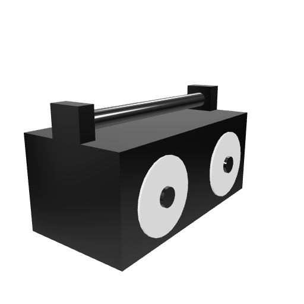](models/Animated_Boomboxhead.glb) | [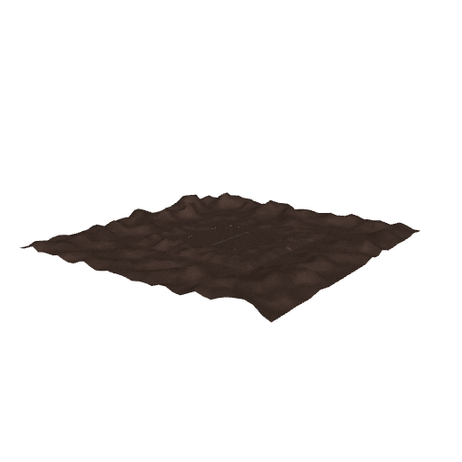](models/environment/desert_street.glb) | [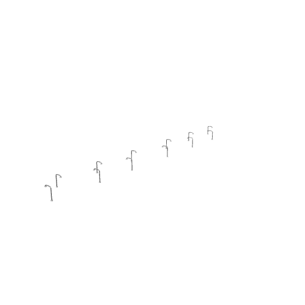](models/environment/Lightlamps.glb) |  |  |  |
|  | [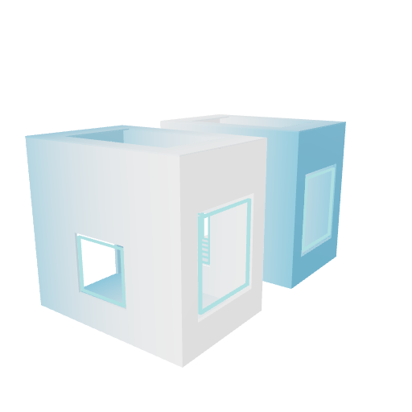](models/booths/opti/pearlhyacinth_neonboothfinaltwin.glb) | [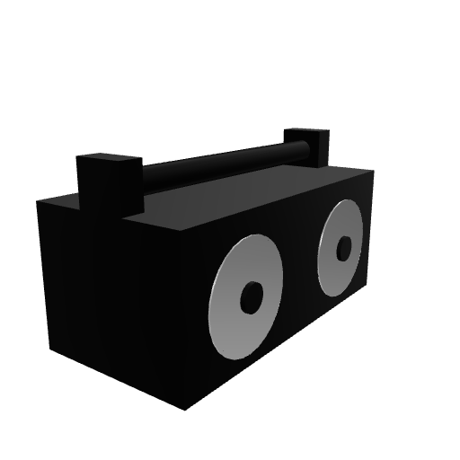](models/booths/opti/Animated_Boomboxhead2.glb) |  | [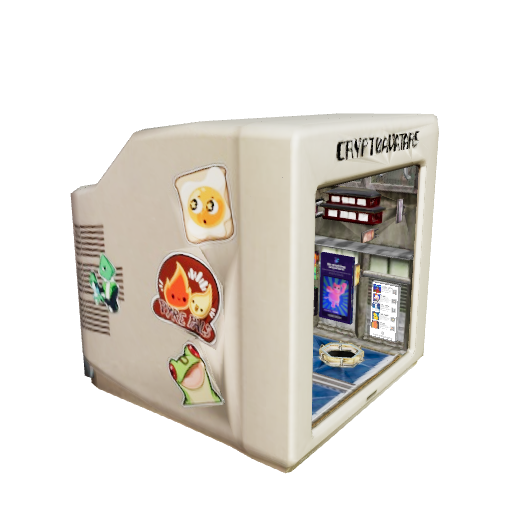](models/booths/opti/cryptoavatars_Booth.glb) | [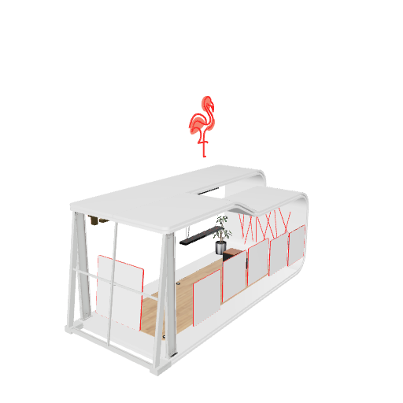](models/booths/opti/croquet.glb) |
| [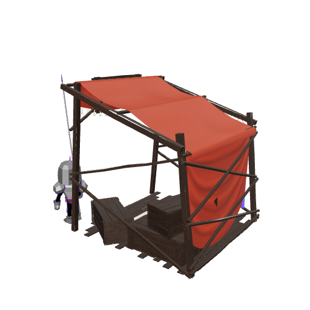](models/booths/opti/acandar_booth-v1.glb) |  | [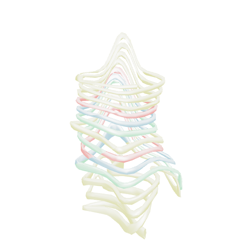](models/booths/opti/dfw-emy.glb) | [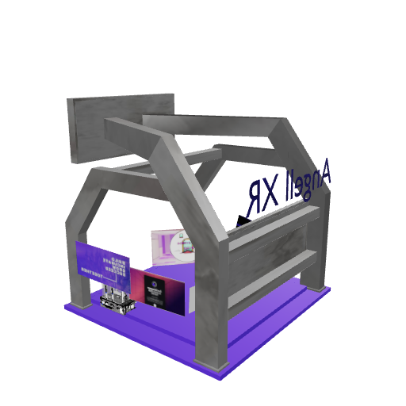](models/booths/opti/mrmetaverse_booth2.glb) | [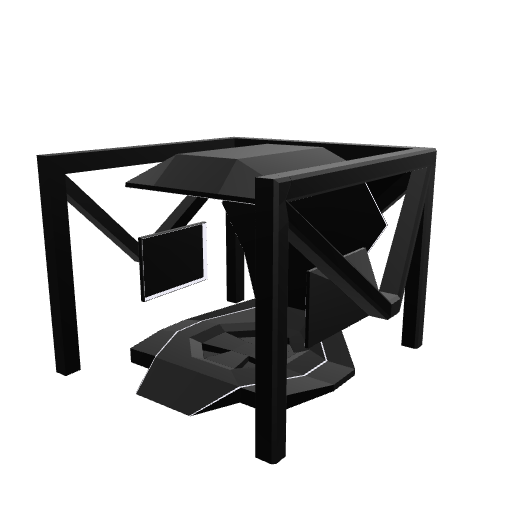](models/booths/opti/template_booth.glb) |  |
|  | [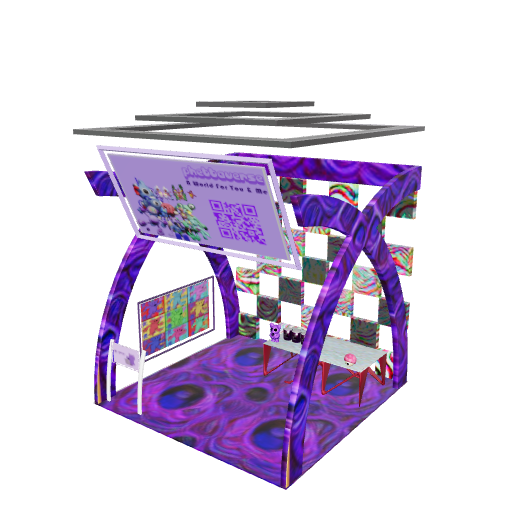](models/booths/opti/phetta_booth.glb) |  | [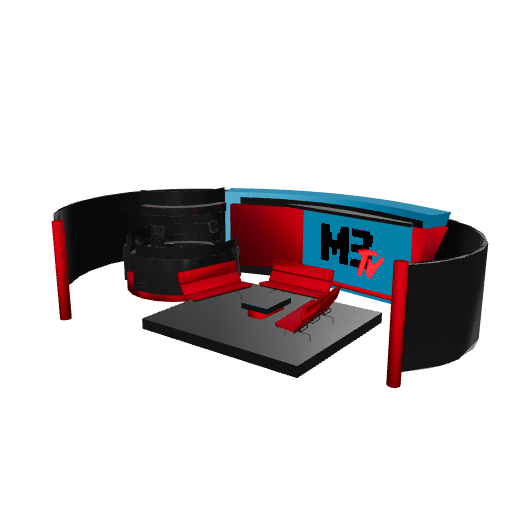](models/booths/opti/M3TV_stage.glb) |  |  |
| [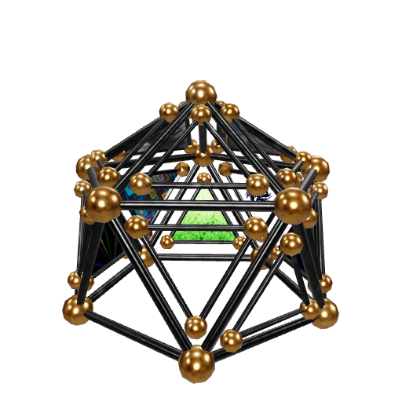](models/booths/opti/arashi_geobooth.glb) |  |  | [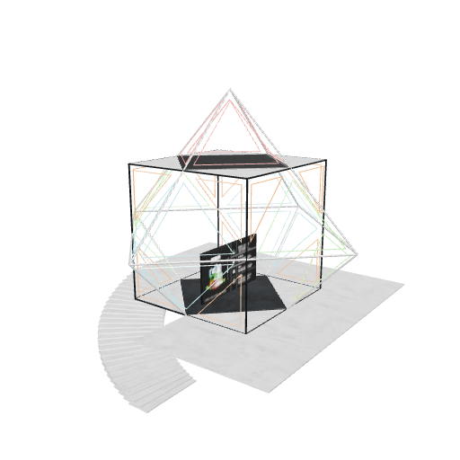](models/booths/opti/untitledxyz_booth.glb) |  |  |
|  |  |  | [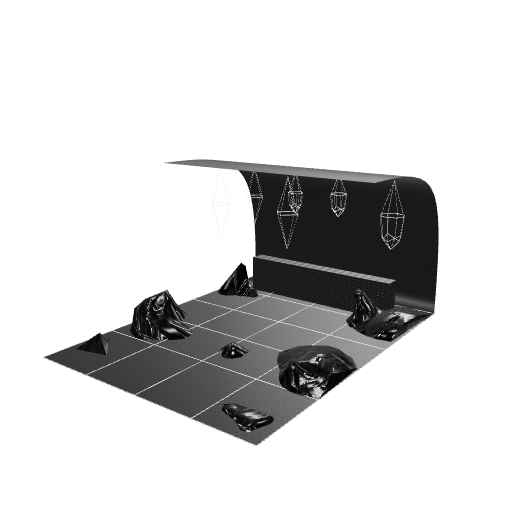](models/booths/opti/memory_booth.glb) |  |  |
| [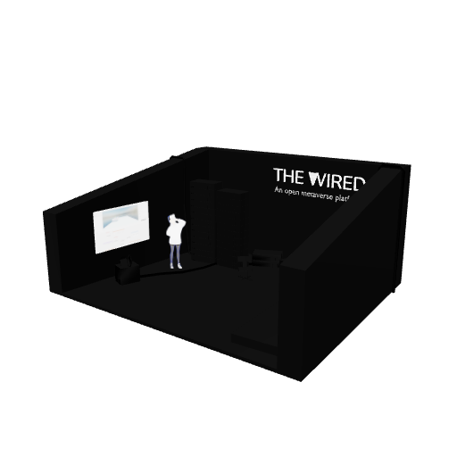](models/booths/opti/wiredspace.glb) | [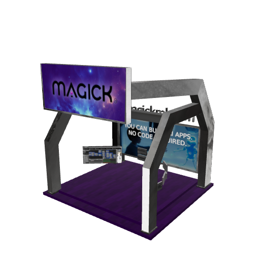](models/booths/opti/magickbooth.glb) | [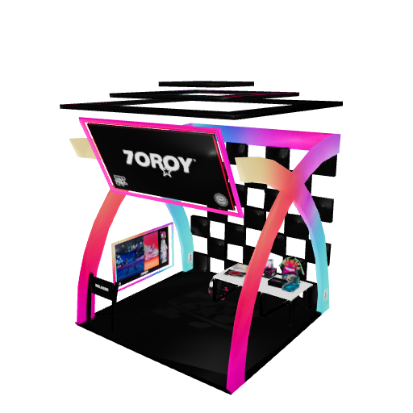](models/booths/opti/7oroy_BOOTH12.glb) |  | [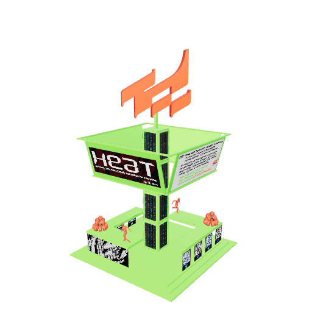](models/booths/opti/HEAT_Booth1_Final-v1.glb) |  |
|  |
 ## templates

| 1 | 2 | 3 |
| --- | --- | --- |
| [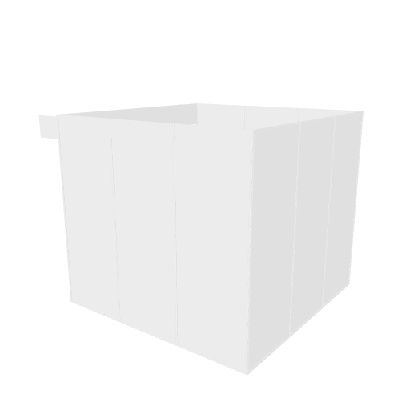](templates/SampleBooth.glb) | [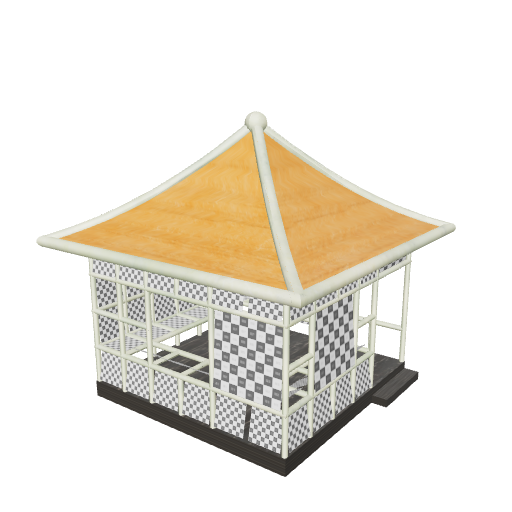](templates/Booth2_teahouse.glb) | [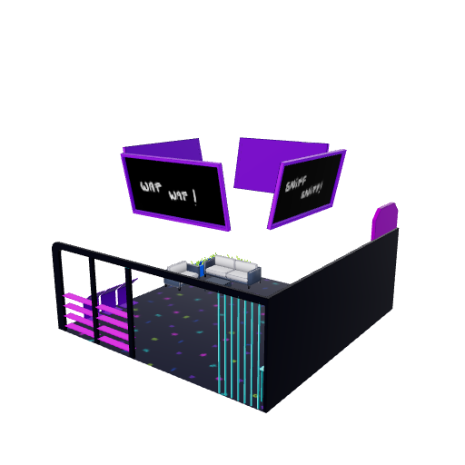](templates/ExpoBooth_Kiiba.glb) |
|  |  | [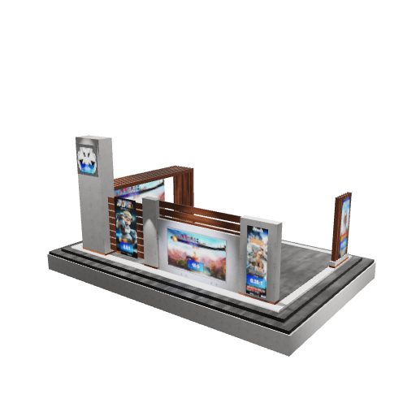](templates/sith_template.glb) |
|  |  | [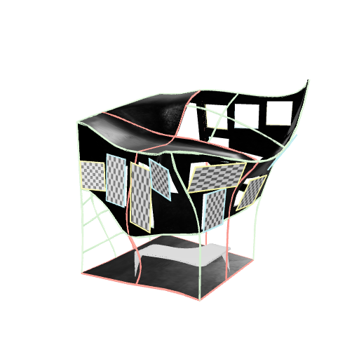](templates/booth3_neonified.glb) |
|  | [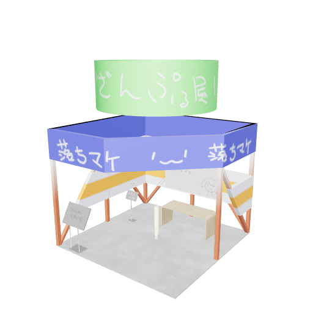](templates/standard.glb) | [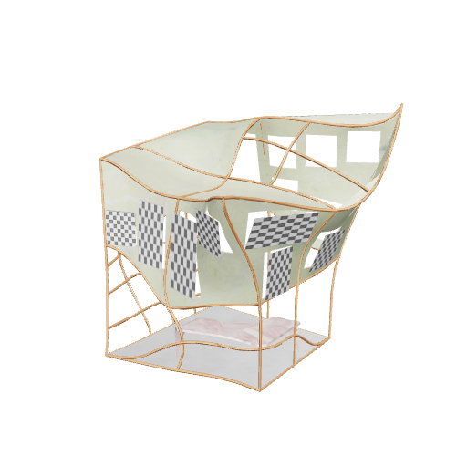](templates/Booth3_pastel.glb) |
| [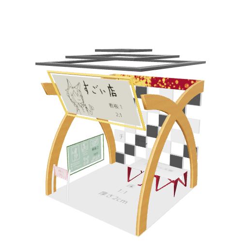](templates/defaultbooth.glb) |  |
